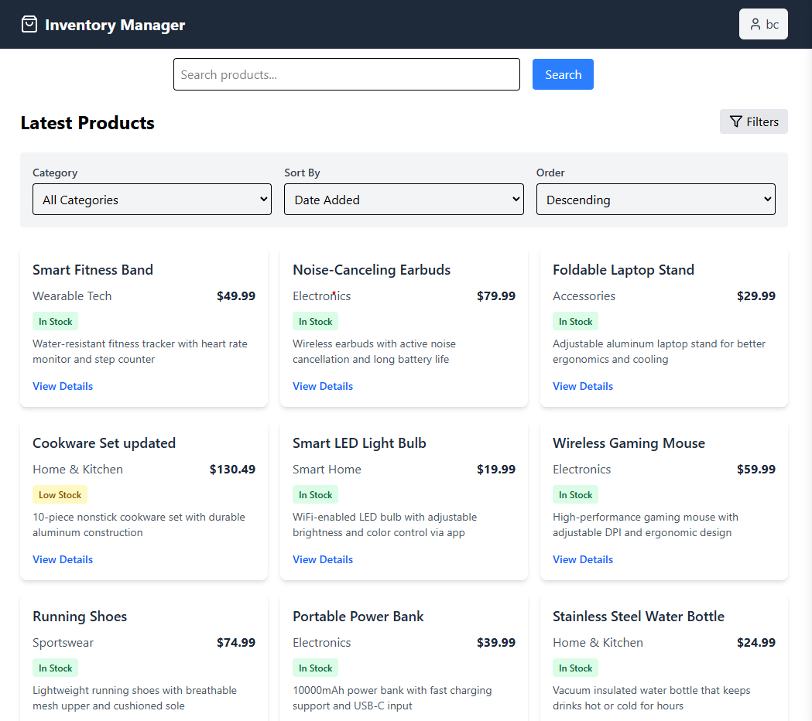
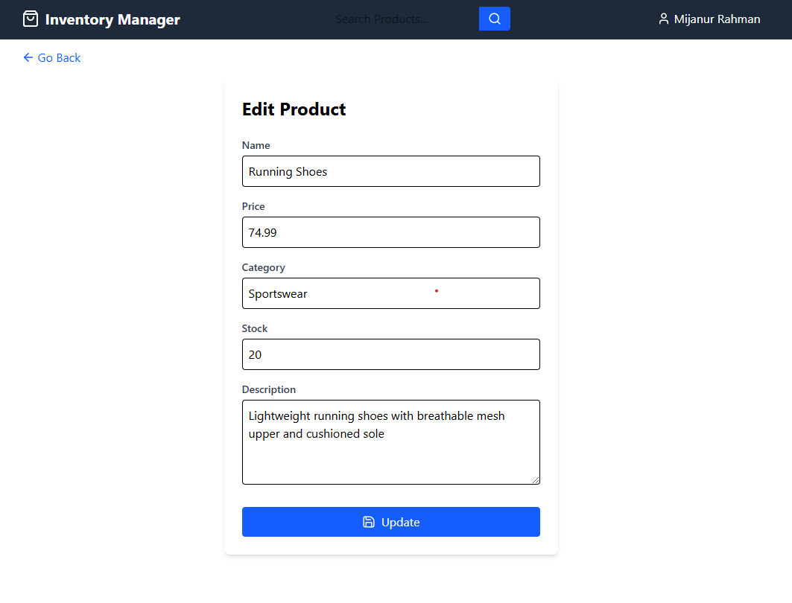
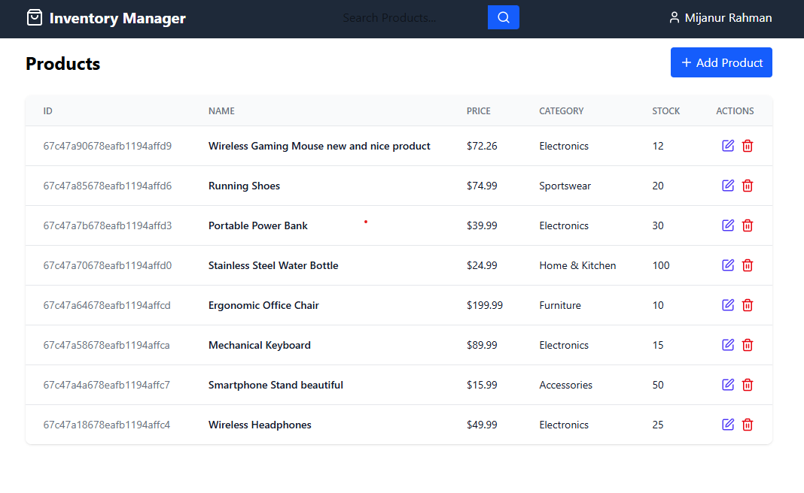

📁 MERN-Inventory-Management

## Project Description

A full-stack MERN (MongoDB, Express.js, React, Node.js) application for product inventory management. The application provides CRUD operations, authentication, sorting, filtering, and pagination.

## Features

-   CRUD operations for products (Create, Read, Update, Delete)
-   Authentication with JWT (Login & Protected Routes)
-   Sorting, Filtering, and Pagination
-   Responsive UI with React & Tailwind CSS
-   Backend deployed on Render/Vercel
-   Frontend deployed on Vercel/Netlify

---

## Folder Structure

```
MERN-Inventory-Management/
│
├── backend/                  # Node.js & Express backend
│   ├── config/               # Configuration files
│   │   ├── db.js             # MongoDB connection setup
│   │   ├── dotenv.config.js  # Environment variables
│   │
│   ├── models/               # Mongoose models
│   │   ├── Product.js        # Product Schema
│   │   ├── User.js           # User Schema
│   │
│   ├── routes/               # API routes
│   │   ├── productRoutes.js  # Product routes
│   │   ├── userRoutes.js     # User authentication routes
│   │
│   ├── middleware/           # Middleware for authentication & error handling
│   │   ├── authMiddleware.js # JWT authentication middleware
│   │   ├── errorHandler.js   # Global error handling
│   │
│   ├── controllers/          # Controller functions
│   │   ├── productController.js # CRUD logic for products
│   │   ├── userController.js    # Authentication logic
│   │
│   ├── server.js             # Express server entry point
│
├── frontend/                 # React frontend
│   ├── src/
│   │   ├── components/       # Reusable UI components
│   │   ├── pages/            # Page components
│   │   ├── context/          # Global state management
│   │   ├── hooks/            # Custom React hooks
│   │   ├── App.js            # Main app component
│   │   ├── index.js          # React entry point
│
├── README.md                 # Project documentation
├── .gitignore                 # Git ignored files
├── package.json               # Project dependencies
├── .env.example               # Environment variable example
```

## Project Photos





## Setup Instructions

### Backend Setup

1. Navigate to the `backend/` directory:
    ```sh
    cd backend
    ```
2. Install dependencies:
    ```sh
    npm install
    ```
3. Create a `.env` file in `backend/` and add:
    ```sh
    MONGO_URI=your_mongodb_connection_string
    JWT_SECRET=your_jwt_secret_key
    PORT=5000
    ```
4. Start the backend server:
    ```sh
    npm run dev
    ```

### Frontend Setup

1. Navigate to the `frontend/` directory:
    ```sh
    cd frontend
    ```
2. Install dependencies:
    ```sh
    npm install
    ```
3. Create a `.env` file in `frontend/` and add:
    ```sh
    REACT_APP_API_URL=http://localhost:5000/api
    ```
4. Start the frontend server:
    ```sh
    npm start
    ```

---

# Product-Inventory
